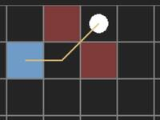
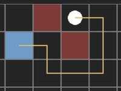
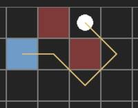
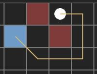

# 2D Game Grid (square)
A simple square grid made for games with built-in features like:
- get the shortest path between cells
- list reachable cells (pathfinding)
- list cell neighbors
- get distance between cells
- list cells in distance

Missing a feature? [Create an issue](https://github.com/mstuercke/2d-game-grid/issues)!

## Examples & Demos
- [example code](https://codesandbox.io/s/y3xt8s)  
  a basic implementation
- [interactive demo](https://3ms9ky.csb.app/)  
  a customizable playground to visualize all the features

## Usage
### Installation
Install [2d-game-grid](https://www.npmjs.com/package/2d-game-grid) to your project with one of the following commands: 
#### npm
```
npm install 2d-game-grid
``` 
#### yarn
```
yarn add 2d-game-grid
```

### Create a grid
Both examples will create the exact same grid
#### Use pre-generated cells
```ts
import {Grid} from '2d-game-grid';

const grid = new Grid({
  grid: [
    ['0-0', '0-1', '0-2', '0-3'],
    ['1-0', '1-1', '1-2', '1-3'],
    ['2-0', '2-1', '2-2', '2-3']
  ]
});
```

#### Generate cells on initialization
```ts
import {Grid} from '2d-game-grid';

const grid = new Grid({
  width: 4,
  height: 3,
  initializeCellValue: ({row, col}) => `${row}-${col}`,
});
```

### Get cell
```ts
const cell = grid.getCell({row: 1, col: 2});
console.log(cell.value) // '1-2'
```

### Get cells of a row
```ts
const row = grid.getRow(1);
console.log(row.cells.map(cell => cell.value)) // ['1-0', '1-1', '1-2', '1-3']
```

### Get cells of a column
```ts
const column = grid.getColumn(1);
console.log(column.cells.map(cell => cell.value)) // ['0-1', '1-1', '2-1']
```

### Get neighbors of a cell
```ts
const cell = grid.getCell({row: 1, col: 2});
const leftNeighbor = cell.neighbors.get('LEFT');
console.log(leftNeighbor.value); // '1-1'
```

### Get the distance between cells
```ts
const cell = grid.getCell({row: 1, col: 2});
const distance = cell.getDistance({row: 1, col: 0});
console.log(distance); // 2
```

### List all cells in distance
```ts
const cell = grid.getCell({row: 0, col: 3});
const cells = cell.listCellsInDistance(2);
console.log(cells.map(cell => cell.value)); // ['1-2', '2-3', '0-1', '0-2', '1-3']
```

#### Algorithms
- [Manhattan](https://en.wikipedia.org/wiki/Taxicab_geometry)
- [Euclidean](https://en.wikipedia.org/wiki/Euclidean_distance)

### Get the shortest path between cells
The pathfinding uses the [pathfinding](https://www.npmjs.com/package/pathfinding) package.  

```ts
const cell = grid.getCell({row: 1, col: 2});
const path = cell.getPath({row: 0, col: 0});
console.log(path.map(cell => cell.value)); // ['1-2', '0-1', '0-0']
```
Hint: The returned path will always include the start and the end.

#### Algorithms
- [A* (A Star)](https://en.wikipedia.org/wiki/A*_search_algorithm)
- [Best First](https://en.wikipedia.org/wiki/Best-first_search)
- [Breadth First](https://en.wikipedia.org/wiki/Breadth-first_search)
- [Dijkstra](https://en.wikipedia.org/wiki/Dijkstra%27s_algorithm)

#### Diagonal movement
You can decide which diagonal movements should be allowed: 
- Always  
  
- Never  
  
- If at most one obstacle  
  
- Only when no obstacles  
  

#### Heuristic
You can either choose between the following heuristic algorithms:
- [Manhattan](https://en.wikipedia.org/wiki/Taxicab_geometry)
- [Chebyshev](https://en.wikipedia.org/wiki/Chebyshev_distance)
- [Euclidean](https://en.wikipedia.org/wiki/Euclidean_distance)
- Octile

Or pass your own heuristic function:
```ts
cell.getPath({row: 1, col: 0}, {
  heuristic: (cell) => {/* your implementation */}
});
```

### List all reachable cells (pathfinding)
```ts
const cell = grid.getCell({row: 0, col: 3});
const cells = cell.listReachableCells(3);
console.log(cells.map(cell => cell.value)); // ['1-2', '2-3', '2-1', '0-1', '1-1', '2-2', '0-2', '1-3']
```

### Extend grid with another grid
```ts
const gridA = new Grid({grid: [["A"]]})
const gridB = new Grid({grid: [["B"]]})

gridA.extend(gridB, 'LEFT')  // B A
gridA.extend(gridB, 'RIGHT') // A B
```

### Crop grid
```ts
const cells = grid.crop({row: 0, col: 1}, {row: 1, col: 2}).grid;
console.log(cells.map(cell => cell.value)); // [['0-1', '0-2'], ['1-1', '1-2']]
```


### Listen for cell value changes
#### Register
```ts
grid.onCellValueChanged((event) => {/* your implementation */});
grid.getRow(1).onCellValueChanged((event) => {/* your implementation */});
grid.getColumn(2).onCellValueChanged((event) => {/* your implementation */});
grid.getCell({row: 1, col: 2}).onValueChanged((event) => {/* your implementation */});
```

#### Trigger
```ts
const cell = grid.getCell({row: 1, col: 2});
cell.value = 'new value'; // updating this value will trigger all callbacks of the "Register" example
```

To trigger this event correctly, your value should be treated immutable.
If you're using an object or array as value, you have to replace the object/array to trigger the callbacks.
```ts
// object
cell.value.text = 'foo'; // will NOT trigger any callback
cell.value = {...cell.value, text: 'foo'}; // will trigger the callbacks

// array
cell.value.push('foo'); // will NOT trigger any callback
cell.value = [...cell.value, 'foo']; // will trigger the callbacks
```

#### Unregister
The `onCellValueChanged()` and `onValueChanged()` functions return a function to unregister. 
When you execute this unregister function, the callback will not be called anymore.

```ts
const unregister = grid.onCellValueChanged((event) => {/* your implementation */});
unregister();
```

## Collaboration
Feel free to create issues or merge requests

### Release package
Modify the version in `package.json`. When running the pipeline on `master` a new package will be deployed with that version. 


